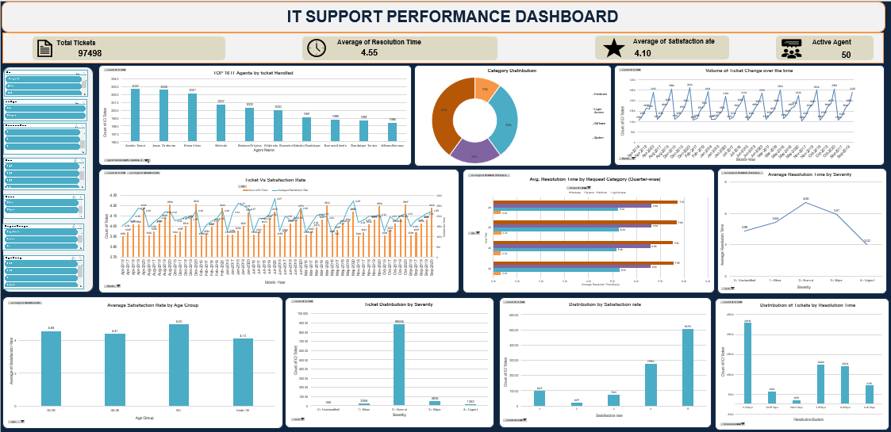

# IT Ticket Analysis Dashboard | Excel
## Project Overview
This project analyzes 97,498 IT support tickets to evaluate support performance, resolution time, ticket categories, severity levels, and user satisfaction.
An interactive Excel dashboard was developed to transform raw ticket data into meaningful insights and support data-driven decision-making.
## Key KPIs
- Total Tickets: 97,498
- Average Resolution Time: 4.55 Days
- Average Satisfaction Rate: 4.10
- Active Agents: 50
## Dashboard Analysis
The dashboard provides insights into:
- Ticket volume and trends
- Category-wise ticket distribution
- Average resolution time by category
- Ticket distribution by severity
- Satisfaction rate analysis
- Agent-wise ticket handling
- Age-group analysis
- Resolution time patterns
## Tools & Skills
- Microsoft Excel
- Pivot Tables
- Pivot Charts
- Slicers
- KPI Analysis
- Data Cleaning
- Data Visualization
- Business Analysis
## Key Objective
- Identify operational bottlenecks in IT support processes.
- Improve resolution time by analyzing ticket and category-level trends.
- Optimize resource utilization through data-driven insights.
- Enhance user satisfaction by identifying factors affecting service quality.
## Dashboard Preview

## 👤 Author
*Rajiv Kumar | Data Analyst | SQL | Excel | Power BI | Python*
🔗 [LinkedIn](https://www.linkedin.com/in/rajiv-kumar-da/)
